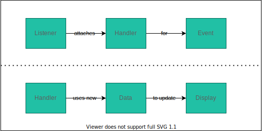
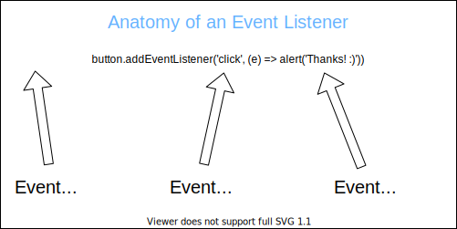

# 📅 Events 📅

---

### Lecture Goals

- Explain the importance of event handling in modern web applications
- Explain how callback functions are used with event listeners
- Observe how to add a form to a webpage using HTML and JavaScript
- Observe how onSubmit events are used to receive information from Users via forms
- Explain the purpose of .preventDefault() method
- Use MDN to discover and interact with JavaScript events

---

---

---

---

---

---

## The Click Event

<button id="clickme" style="padding: 1.5rem 2rem; font-size: 2rem;">Click Me!</button>

<pre><code data-line-numbers><button id="clickme" style="padding: 1.5rem 2rem; font-size: 2rem;">Click Me!</button>

</code></pre>

- Why would `addEventListener` be considered a higher order function?
- In which case is `handleClick` behaving as an event handler? Line 4 or line 8? Why?

---

## The Submit Event

<form>
  <input type="text" name="q" />
  <input type="submit" />
</form>

<pre><code data-line-numbers><form>
  <input type="text" name="q" />
  <input type="submit">Search</input>
</form>

</code></pre>

---

## The Submit Event (with preventDefault)

<form id="otherForm">
  <input type="text" name="q" />
  <input type="submit" />
</form>

<pre><code data-line-numbers><form>
  <input type="text" name="q" />
  <input type="submit">Search</input>
</form>

</code></pre>

---

## Let's Code!

- Users should be able to delete books by clicking the delete button at the bottom of the book card
- Users should be able to add a book by filling in the form at the top of the page (the book they add should appear in the DOM)