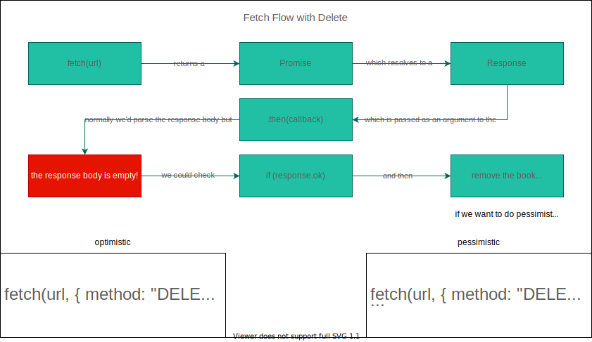
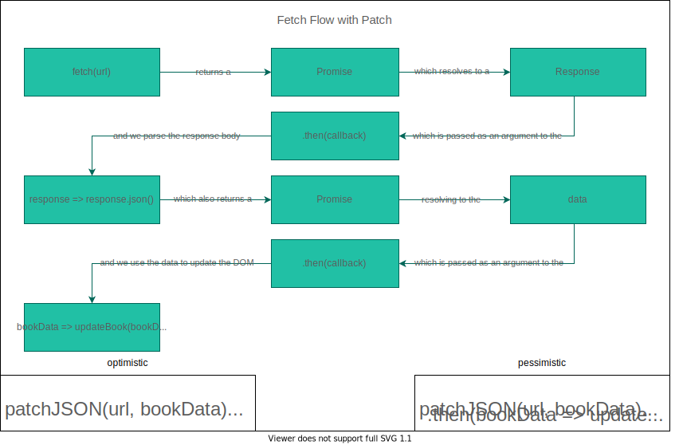
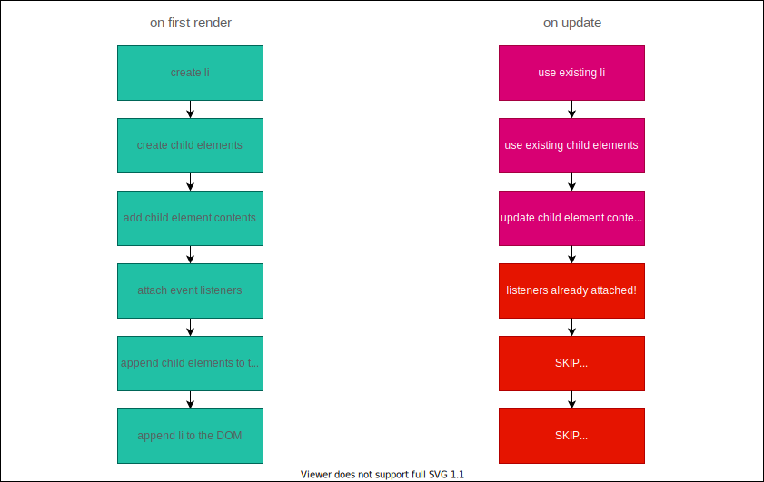

## PATCH & DELETE Requests

---

## Lecture Goals

- Review how to send a PATCH request using HTML forms and JavaScript
- Review how to send a DELETE request using HTML buttons and JavaScript
- Explain the difference between optimistic and pessimistic rendering

---

---

---

