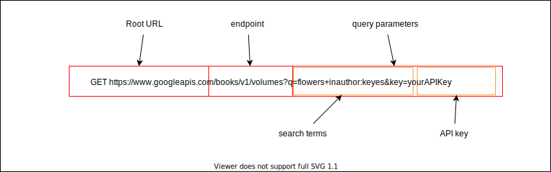

## Communicating with External APIs

---

## Lecture Goals

-  Explain what an API is
-  Explain the limitations of working with an external API
-  Observe how to parse API documentation
-  Observe how to send a GET request to an external API with / without an API key

---

### The Restaurant Analogy


<small>[https://medium.com/vody-techblog/understanding-what-apis-are-all-about-ff2513b76a55](https://medium.com/vody-techblog/understanding-what-apis-are-all-about-ff2513b76a55)</small>

---

### Downsides of External APIs


---

### The main upside!


---

### Examples

- <a href="https://www.tvmaze.com/api" target="_blank">TVMaze API</a>
- <a href="https://developers.google.com/books/docs/overview" target="_blank">Google Books API</a>
- <a href="https://github.com/toddmotto/public-apis" target="_blank">List of Publicly accessible APIs</a>

---

### Google Books API Checklist (part 1) - Creating your Project and API key

- [Read the docs for Using the API](https://developers.google.com/books/docs/v1/using) {.fragment}
- Follow the link in the [Acquiring and Using an API key section](https://developers.google.com/books/docs/v1/using#APIKey) to the [credentials page in the API console](https://console.cloud.google.com/apis/credentials) {.fragment}
- Click on the Dropdown near the top of the page (to the right of the Google Cloud logo) to create a new project. I'm calling mine Books Project. {.fragment}
- Click on the Create Credentials button and select API key. {.fragment}


---

### Google Books API Checklist (part 2) - Adding the API you want to use


- Click the sidebar option for: Enable APIs and Services {.fragment}
- In the search input at the top, type: Books API and select it from the Marketplace search results {.fragment}
- Click the blue enable button to allow your API key to access the Books API {.fragment}

---

### Google Books API Checklist (part 3) - Creating your API key


<small>[https://securityintelligence.com/articles/passwordless-authentication-risks-benefits/](https://securityintelligence.com/articles/passwordless-authentication-risks-benefits/)</small>

- Navigate to the Credentials page for your project and click on your API key {.fragment}
- Click the clipboard button to copy the API key. {.fragment}
- add the API key to a local file in your project. (`const API_KEY="paste_your_key_here"`) {.fragment}
- <b>Make sure to tell git to ignore this file!</b> {.fragment}

---

### .gitignore

- add a file in the root of your project called `.gitignore` (this should be inside of the 07_ folder) {.fragment}
- this file will contain a list of files & folders for which git will not track changes {.fragment}
- in our case, add `src/keys.js` on its own line within this file. {.fragment}
- ✅⁇: check your version control tab within VSCode and make sure you <b>don't</b> see your `keys.js` file there. If you do, then check for a mismatch between what you have in your `.gitignore` and the name/path to the `keys.js` file. {.fragment}
- ✅ When keys.js <b>doesn't appear</b> in the list of files with untracked changes, you've done this step correctly. {.fragment}
-

---

### Using the API



[View docs](https://developers.google.com/books/docs/v1/using#PerformingSearch) for more details.


```js
fetch(`https://www.googleapis.com/books/v1/volumes?q=${encodeURI(query)}&key=${API_KEY}`)
  .then(res =>res.json())
  .then(console.log);
```